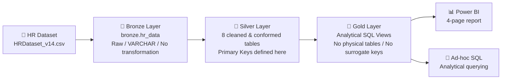
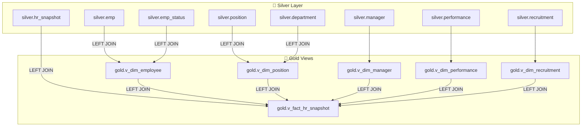

# HR Data Warehouse & Analytics Project

> A complete **Medallion Architecture (Bronze → Silver → Gold)** data warehouse built on SQL Server, transforming a single flat HR CSV extract into a governed, analysis-ready star schema, automated via SQL Server Agent, and consumed through a 4-page Power BI report.


---

## 📌 Table of Contents

- [Overview](#-overview)
- [Architecture](#-architecture)
- [Tech Stack](#-tech-stack)
- [ETL Pipeline & Automation](#-etl-pipeline--automation)
- [Repository Structure](#-repository-structure)
- [Installation & Setup](#-installation--setup)
- [Data Dictionary](#-data-dictionary)
- [Power BI Dashboard](#-power-bi-dashboard)
- [Data Validation](#-data-validation)
- [Known Limitations](#-known-limitations)
- [Roadmap](#-roadmap)
- [Contributors](#-contributors)
- [License](#-license)

---

## 📊 Overview

HR departments typically hold employee data — demographics, compensation, performance, recruitment source, tenure, and termination reasons — in a single flat operational file that isn't prepared for analysis.

This project converts that flat file into a governed, three-layer data warehouse, enabling reliable, repeatable, self-service HR reporting instead of ad-hoc spreadsheet manipulation.

### Key Facts

| Item | Details |
|---|---|
| Source dataset | `HRDataset_v14` |
| Records | **311 employees** |
| Source columns | **36** |
| Grain | One row per employee |
| Architecture | **Medallion: Bronze → Silver → Gold** |
| Database | Microsoft SQL Server |
| ETL | T-SQL |
| Automation | SQL Server Agent |
| Reporting | Power BI |
| Gold layer | 5 dimension views + 1 fact view |

### Medallion Architecture

| Layer | Description |
|---|---|
| 🥉 **Bronze** | Raw, unmodified copy of the source CSV loaded via `BULK INSERT`. Every column is `VARCHAR(MAX)` with no type casting or cleaning. |
| 🥈 **Silver** | Cleaned, standardized, type-cast, deduplicated, and conformed physical tables. Primary Keys are defined here. This is the single source of truth. |
| 🥇 **Gold** | Business-ready analytical SQL Views built directly on Silver: 5 dimension views + 1 fact view. No physical Gold tables and no surrogate keys. |

> **Implementation note:** The Gold layer is implemented as **Views**, not physical tables. Views avoid duplicating data already governed in Silver, keep business logic centralized, and allow Power BI to query a simplified presentation-ready structure that always reflects the current state of Silver.

---

# 🏗️ Architecture

## High-Level Architecture



## Data Lineage — Silver → Gold



### Important Modeling Notes

- Employee Status is embedded inside `gold.v_dim_employee`.
- Department is embedded inside `gold.v_dim_position`.
- `gold.v_dim_recruitment` does not have a `recruitment_id`; its business key is `RecruitmentSource`.
- Gold is a pure presentation layer over Silver.
- Primary Keys live in the Silver layer.

---

# 🛠️ Tech Stack

| Technology | Role | Why It Was Chosen |
|---|---|---|
| **Microsoft SQL Server** | Hosts the database and Bronze / Silver / Gold schemas | Industry-standard relational engine with native schema support, `BULK INSERT`, and Agent scheduling |
| **SSMS** | Development and execution environment | Native T-SQL authoring/debugging and SQL Server Agent job management |
| **T-SQL** | ETL logic | Keeps cleaning and modeling logic close to the data |
| **SQL Server Agent** | Schedules the ETL pipeline | Native scheduling and immediate-stop behavior on failure |
| **Power BI Desktop** | Semantic model, DAX, and 4-page report | Time-intelligence measures and native star-schema modeling |
| **CSV / Excel** | Raw source format | Represents a realistic HRIS flat-file export scenario |
| **GitHub** | Version control and delivery | Single source of truth for scripts, documentation, and the Power BI file |

---

# ⚙️ ETL Pipeline & Automation

The project uses six SQL scripts in a defined execution order.

| Step | Script | Purpose | Depends On | Objects Created |
|---:|---|---|---|---|
| 1 | `00_initialize_database.sql` | Create database and 3 schemas | — | `HR_Project`, `bronze`, `silver`, `gold` |
| 2 | `01a_bronze_load.sql` | Load raw CSV using `BULK INSERT` | 00 | `bronze.hr_data` |
| 3 | `01b_bronze_profiling.sql` | Run 15 data-quality diagnostics | 01a | Query results only |
| 4 | `02_silver_transformation.sql` | Clean, type-cast, standardize, and conform | 01a | 8 Silver tables |
| 5 | `03_gold.sql` | Build analytical Gold Views + validation queries | 02 | 5 dimension views + 1 fact view |
| 6 | `04_sql_agent_job.sql` | Automate and schedule the pipeline | 00–03 | 1 SQL Server Agent job |

### SQL Server Agent

All five pipeline execution steps are chained in a single **Daily ETL** SQL Server Agent job.

- Scheduled: **once a day**
- On success: continue to the next step
- On failure: quit and report failure
- The pipeline therefore does not silently continue after a failed step

> ⚠️ **Known gap:** The delivered Agent job's Step 5 (`03_Gold`) still embeds the legacy physical-table Gold DDL with surrogate keys instead of the current View-based `03_gold.sql`. Update this step before relying on the scheduled job for a production rebuild.

---

# 📁 Repository Structure

```text
project root/
│
├── README.md
│
├── data/
│   ├── HRDataset_v14.csv
│   └── README.md
│
├── scripts/
│   ├── 00_initialize_database.sql
│   ├── 01a_bronze_load.sql
│   ├── 01b_bronze_profiling.sql
│   ├── 02_silver_transformation.sql
│   ├── 03_gold.sql
│   └── 04_sql_agent_job.sql
│
├── docs/
│   ├── Architectural Diagram.jpg
│   ├── Data Flow.jpg
│   ├── Data Model (Star Schema).jpeg
│   ├── ELT Pipeline.png
│   └── HR_DataWarehouse_Technical_Documentation.docx
│
└── power bi/
    ├── HR_Analysis_Dashboard_project.pbix
    ├── Data Model.png
    ├── Dashboard1.png
    ├── Dashboard2.png
    ├── Dashboard3.png
    └── Dashboard4.png
```

### Folder Purpose

| Folder | Purpose |
|---|---|
| `data/` | Raw CSV source and source notes |
| `scripts/` | All T-SQL scripts in required execution order |
| `docs/` | Architecture, lineage, ELT pipeline, and star-schema documentation |
| `power bi/` | Power BI `.pbix` file, model screenshot, and dashboard screenshots |

---

# 🚀 Installation & Setup

## Prerequisites

- Microsoft SQL Server — Developer or Express edition is sufficient for this data volume
- SQL Server Management Studio (SSMS)
- Power BI Desktop

## 1. Clone the Repository

```bash
git clone https://github.com/rahmahamdy590-del/HR-DataWarehouse-Project.git
```

## 2. Set the `BULK INSERT` Source Path

Open:

```text
scripts/01a_bronze_load.sql
```

Update the `BULK INSERT ... FROM` path to your local copy of:

```text
data/HRDataset_v14.csv
```

Example:

```sql
BULK INSERT bronze.hr_data
FROM 'C:\path\to\your\HRDataset_v14.csv'
WITH (
    FORMAT = 'CSV',
    FIRSTROW = 2,
    FIELDQUOTE = '"',
    FIELDTERMINATOR = ',',
    ROWTERMINATOR = '0x0d0a',
    CODEPAGE = '65001',
    TABLOCK
);
```

> ⚠️ The delivered script currently uses a hard-coded local Windows path. Change it before running the project on another machine.

## 3. Run the SQL Scripts in Order

Run the following scripts in SSMS:

```text
00_initialize_database.sql
        ↓
01a_bronze_load.sql
        ↓
01b_bronze_profiling.sql
        ↓
02_silver_transformation.sql
        ↓
03_gold.sql
```

## 4. Optional — Automate the Pipeline

Deploy:

```text
04_sql_agent_job.sql
```

to an instance running SQL Server Agent.

> Remember to update Agent Job Step 5 (`03_Gold`) so that it calls the current View-based `03_gold.sql`.

## 5. Open the Power BI Report

Open:

```text
power bi/HR_Analysis_Dashboard_project.pbix
```

Then:

1. Go to **Transform Data → Data Source Settings**
2. Redirect the connections to:
   - Database: `HR_Project`
   - Schema: `gold`
3. Refresh the report

---

# 📖 Data Dictionary

The Gold layer exposes:

- **5 dimension views**
- **1 fact view**

Gold has no Primary Key, Foreign Key constraint, or surrogate/`IDENTITY` key. The real Primary Keys live in Silver.

## `gold.v_dim_employee`

Built from:

```text
silver.emp
LEFT JOIN
silver.emp_status
```

Includes Employee Status.

| Column | Description |
|---|---|
| `emp_id` | Business key — employee ID |
| `emp_name` | Standardized full employee name |
| `sex` | Gender |
| `dob` | Date of birth |
| `marital_desc` | Marital status |
| `citizen_desc` | Citizenship status |
| `hispanic_latino` | Hispanic/Latino origin indicator |
| `race_desc` | Race/ethnicity description |
| `state` | U.S. state |
| `empstatus_id` | Business key — employment status ID |
| `emp_status` | Employment status classification |
| `termreason` | Termination reason, if any |
| `termd` | Termination flag |

## `gold.v_dim_position`

Built from:

```text
silver.position
LEFT JOIN
silver.department
```

Includes Department.

| Column | Description |
|---|---|
| `position_id` | Business key — position ID |
| `position` | Job title |
| `dept_id` | Business key — department ID |
| `dept_name` | Department name |

## `gold.v_dim_manager`

Built from:

```text
silver.manager
```

| Column | Description |
|---|---|
| `manager_id` | Business key — manager ID |
| `manager_name` | Manager's full name |

## `gold.v_dim_performance`

Built from:

```text
silver.performance
```

| Column | Description |
|---|---|
| `performance_id` | Business key — performance rating ID |
| `performance_score` | Performance rating classification |

## `gold.v_dim_recruitment`

Built from:

```text
silver.recruitment
```

There is no `recruitment_id` in the current implementation.

| Column | Description |
|---|---|
| `RecruitmentSource` | Business key — recruitment channel; blank/NULL standardized to `UNKNOWN` |
| `FromDiversityJobFairID` | Flag/ID referencing a diversity job-fair source |

## `gold.v_fact_hr_snapshot`

Built from:

```text
silver.hr_snapshot
```

and joined to each dimension view.

**Grain:** one row per employee HR-snapshot record.

| Column | Source | Description |
|---|---|---|
| `emp_id` | `v_dim_employee` | Employee business key |
| `emp_name` | `v_dim_employee` | Employee name |
| `position_id` | `v_dim_position` | Position business key |
| `position` | `v_dim_position` | Job title |
| `dept_id` | `v_dim_position` | Department business key |
| `dept_name` | `v_dim_position` | Department name |
| `manager_id` | `v_dim_manager` | Manager business key |
| `manager_name` | `v_dim_manager` | Manager name |
| `performance_id` | `v_dim_performance` | Performance business key |
| `performance_score` | `v_dim_performance` | Performance rating |
| `RecruitmentSource` | `v_dim_recruitment` | Recruitment channel |
| `FromDiversityJobFairID` | `v_dim_recruitment` | Diversity job-fair flag/ID |
| `salary` | `silver.hr_snapshot` | Annual salary |
| `absences` | `silver.hr_snapshot` | Total absences |
| `dayslatelast30` | `silver.hr_snapshot` | Days late in the last 30 days |
| `engagementsurvey` | `silver.hr_snapshot` | Engagement survey score (0–5) |
| `empsatisfaction` | `silver.hr_snapshot` | Satisfaction score (1–5) |
| `specialprojectscount` | `silver.hr_snapshot` | Count of special projects |
| `date_hiring` | `silver.hr_snapshot` | Hire date |
| `date_termination` | `silver.hr_snapshot` | Termination date |
| `LastPerformanceReview_Date` | `silver.hr_snapshot` | Date of last performance review |

---

## 🖼️ Project Architecture & Visuals

### High-Level Architecture


### Data Flow / Data Lineage


### ELT Pipeline


### Star Schema


### Power BI Data Model


# 📊 Power BI Dashboard

The report contains **4 pages** and connects to the Gold layer only, using **Import mode**.

| Page | Business Question | Key KPIs |
|---|---|---|
| **Workforce** | What does our current workforce look like? | 311 employees · 56.6% female / 43.4% male · avg. salary $69.02K · avg. satisfaction 3.89 |
| **Turnover & Retention** | How much attrition are we seeing, and why? | Turnover rate 32.80% · Retention rate 67.20% · Highest-turnover department: Production |
| **Recruitment & Hiring** | Which recruitment channels are working? | Total hires 311 · Top source: Indeed · Department with most hires: Sales |
| **Organization Insights** | How is the organization structured, and how are managers performing? | Most common role: Production Technician I · Largest team: 22 |

## 📸 Power BI Report Pages

### 1. Workforce


### 2. Turnover & Retention


### 3. Recruitment & Hiring


### 4. Organization Insights


### Power BI Date Modeling

The model uses a role-playing **Calendar/Date dimension** inside Power BI to support:

- Hire Date
- Termination Date
- Last Performance Review Date

This is implemented using `USERELATIONSHIP`.

---

# ✅ Data Validation

`03_gold.sql` includes built-in validation checks.

### 1. Silver-to-Gold Row Count Reconciliation

Confirms that the fact view does not silently drop or duplicate rows.

### 2. Missing Employee Relationship

Flags fact rows that cannot resolve to an employee.

### 3. Missing Position Relationship

Flags fact rows that cannot resolve to a position or department.

### 4. Employee Status Consistency

Flags any `EmpStatusID` mapping to more than one raw status label.

### 5. Termination-Date Consistency

Flags non-active employees that are missing a termination date.

---

# ⚠️ Known Limitations

> These limitations are part of the current implementation and are documented here so the project remains reproducible and transparent.

1. **Hard-coded file path**  
   The `BULK INSERT` source path in `01a_bronze_load.sql` is a fixed local Windows path and must be edited before running elsewhere.

2. **Outdated SQL Server Agent job step**  
   The Agent job's `03_Gold` step still runs the legacy physical-table DDL instead of the current View-based script.

3. **No SQL-level Date dimension**  
   The Calendar/Date table exists only inside the Power BI model, not as a Gold SQL view.

4. **Static source vs. daily schedule**  
   The source is a one-time CSV extract, so the current daily Agent schedule does not actually capture new data.

5. **No containerization**  
   The project currently runs on a local/on-prem SQL Server instance. Docker packaging is proposed as a future improvement.

---

# 🗺️ Roadmap

- [ ] Update Agent Job Step 5 to run the current Gold Views script
- [ ] Build a native `gold.v_dim_date` calendar dimension
- [ ] Parameterize the `BULK INSERT` source path
- [ ] Containerize SQL Server + pipeline with Docker
- [ ] Move from full reload to incremental loading
- [ ] Publish the report to Power BI Service with scheduled refresh
- [ ] Add Row-Level Security (RLS) by department
- [ ] Migrate to Azure SQL Database / Microsoft Fabric

---

# 👥 Contributors

| Name | Role |
|---|---|
| **Rahma Hamdy** | Team Lead · Gold Layer |
| **Angham Atef** | Database creation & Bronze load layer |
| **Samah Ali** | Bronze data-quality profiling |
| **Hend Mostafa** | Silver Layer |
| **Nermeen Khaled** | Power BI Dashboard |
| **Raghad Atef** | Diagrams |

---

# 📄 License

This project is provided for **educational and portfolio purposes**.

Add a license of your choice (for example, MIT) if you plan to distribute or reuse the code.
